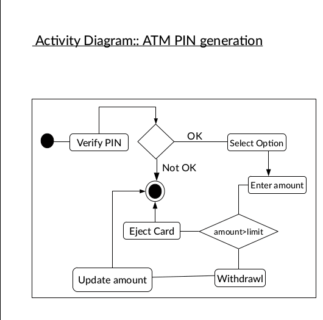
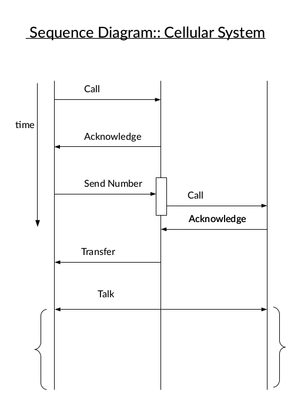
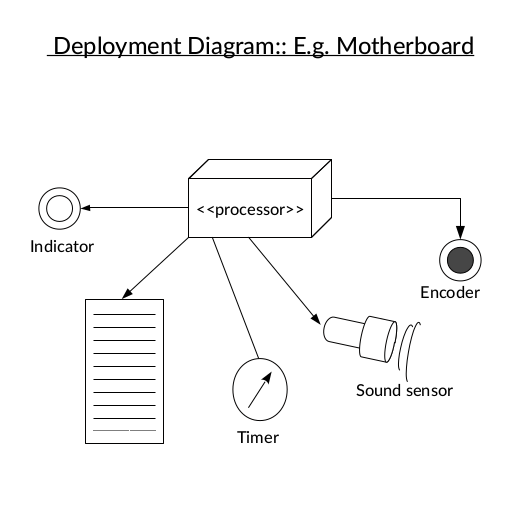

# UML Diagram Examples
UML diagram examples in Software Engineering and Modelling design. Since, there are no standard of drawing digrams in UML diagrams therefore a diagram can be prepared in many possible ways depending on its implementation, features, and user's discretion. These are for references purpose and are given as it is. It is your sole responsibility of using it or how you are using it. 

## Sample diagrams

## Licence 
This document is licenced under Creative Common 3.0 licence. Read more about it [here](https://creative-commons.com/).

